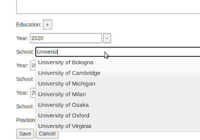
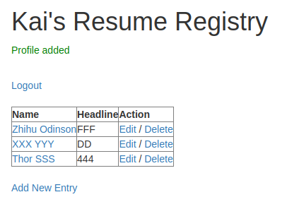

# wa4e_course4_week4

This project comes from the final assignment in [Web Applications for Everybody](https://www.coursera.org/learn/javascript-jquery-json/supplement/zKJ9M/assignment-specification-profiles-positions-and-education). The resume database supports Create, Read, Update, and Delete operations (CRUD) into a Education table that has a many-to-one relationship to our Profile table and a many-to-many relationship to an Institution table. JQuery autocompletion is also implemented.

screenshots:
1. 

2. 

